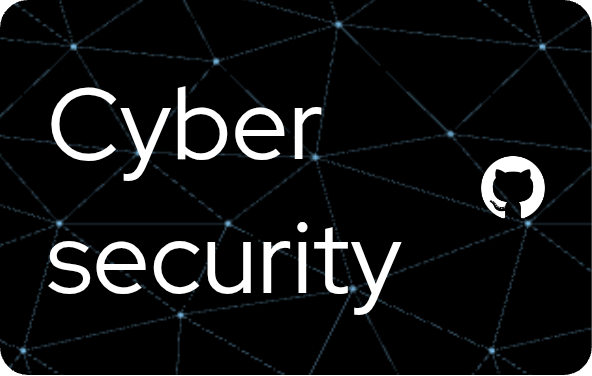

# Hi 👋, I'm Priyanshu Karmakar

A passionate cybersecurity enthusiast and aspiring ethical hacker from India.

**Follow**: `@senpai80085`

---

- 🔭 I’m currently working on **building a personal pentesting lab**
- 🌱 I’m currently learning **Web Pentesting, Burp Suite, Nmap, TryHackMe**
- 🕵️‍♂️ Ask me about **CTFs, Bug Bounty, OWASP Top 10, Linux security**
- 🛡️ Practicing on: **TryHackMe**, **Hack The Box**, **PortSwigger Academy**
- 📫 How to reach me: **priyanshukarmakar136@gmail.com**

---

## Connect with me:

---

## Tools & Technologies:

---

> "Hack to learn, don’t learn to hack."
